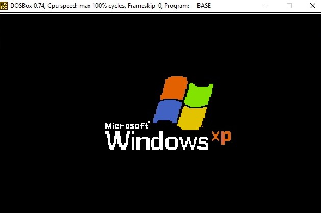

# Desktop-graphics-project
My high-school project in Assembly (2020)

Starting with the windows-xp screen and sound

  

Then the desktop screen showing up with the optinal apps

  

Google chrome

  

File explorer (When clicked there is a sequence of images)

  

Youtube (shows this image and part of the song)

  

To exit - press the windows logo on the left
